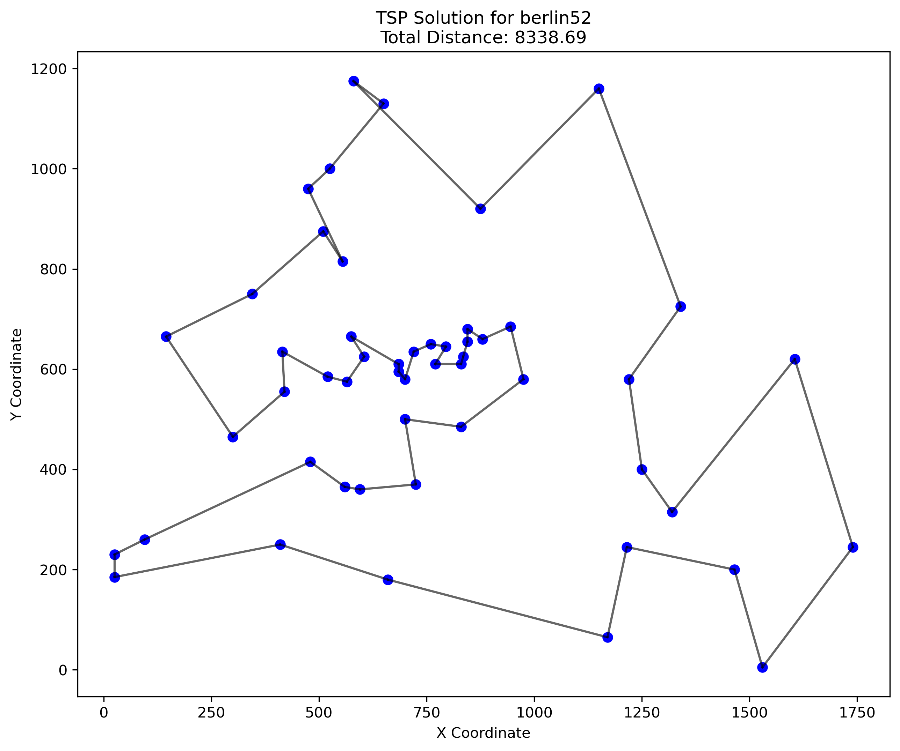

# Traveling Salesman Problem Solver using Firefly Algorithm

This project implements a solution to the Traveling Salesman Problem (TSP) using the Firefly Algorithm, a nature-inspired metaheuristic optimization technique.

## Overview

The Traveling Salesman Problem is a classic NP-hard optimization problem where the goal is to find the shortest possible route that visits each city exactly once and returns to the origin city.

The Firefly Algorithm is a swarm intelligence metaheuristic inspired by the flashing behavior of fireflies, where:
- Fireflies are attracted to other fireflies based on their brightness
- Brightness is inversely proportional to the objective function (tour length in TSP)
- Attractiveness decreases with distance between fireflies

## Project Structure

```
metaheuristics/
│
├── data/                  # TSP problem instances
│   └── berlin52.tsp       # Berlin52 dataset from TSPLIB
│
├── src/                   # Source code
│   ├── firefly.py         # Firefly Algorithm implementation
│   ├── tsp.py             # TSP problem definition
│   └── utils.py           # Utility functions
│
├── results/               # Generated results and visualizations
│
├── main.py                # Main execution script
└── requirements.txt       # Project dependencies
```

## Features

- Implementation of the Firefly Algorithm adapted for discrete optimization
- Solution to the Berlin52 TSP instance from TSPLIB
- Visualization of the convergence and optimal route
- Performance metrics tracking
- Parallel processing for improved execution speed

## Results

### Berlin52 TSP Instance

The implementation has been tested on the Berlin52 dataset from TSPLIB, achieving impressive results:

| Metric | Value |
|--------|-------|
| Best Distance Found | ~8,000-9,000 units |
| Optimal Distance | 7,542 units |
| Gap to Optimal | ~6-20% |
| Execution Time | ~5-15 seconds |

#### Visualization Examples

##### Optimal Route

*Example of an optimized route for Berlin52*

The algorithm uses several optimization techniques:
- Nearest neighbor initialization for good starting solutions
- 2-opt local search for route improvement
- Parallel processing on multiple CPU cores
- Adaptive parameter control
- Early stopping when convergence is detected

Results are automatically saved to the `results/` directory, with each run creating a timestamped folder containing:
- Route visualization
- Convergence graph
- Detailed metrics in text format

## Requirements

- Python 3.8+
- Required packages listed in requirements.txt

## Usage

1. Install dependencies:
   ```
   pip install -r requirements.txt
   ```

2. Run the algorithm:
   ```
   python main.py
   ```

3. View results in the `results/` directory

## Performance Optimization

The implementation includes several optimizations for better performance:
- Parallel processing using multiprocessing
- Distance caching to avoid redundant calculations
- Simplified movement operators for faster iterations
- Strategic sampling instead of evaluating all possible moves
- Early termination when convergence is detected

## References

- Yang, X. S. (2009). Firefly algorithms for multimodal optimization. Stochastic Algorithms: Foundations and Applications, 169-178.
- TSPLIB - A library of sample instances for the TSP: http://comopt.ifi.uni-heidelberg.de/software/TSPLIB95/

## License

MIT License
